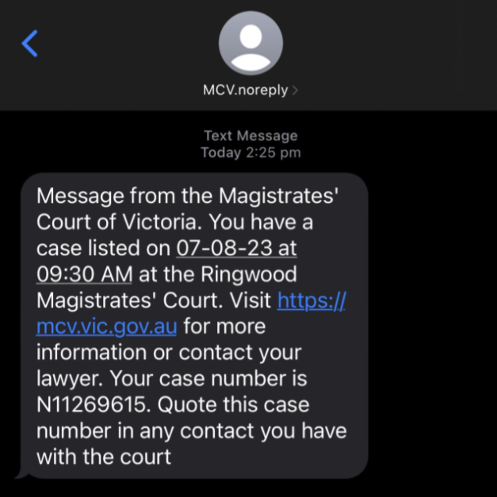

# Project repository for GovHack 2023

## Challenge : Staying one step ahead

> How might we **use open data** to provide insights, identify online intervention points 
> and/**or possible digital solutions** that could 
> **prevent people from falling for any type of online scam**, whether that be at home or at work?
> A string of recent high profile cyber security incidents has highlighted 
> the need to stay ahead of cyber security threats.

## Team : Byte_Me

Alex, Andy, Chale, Ridwan, Trill

## Our Solution

Our approach is to create a digital tool in the form of an aggregator portal that *fights fire with fire*

(Maybe nice to have a screen shot of the web page in here?)

Social platforms can be a threat, but that means they must equally be an opportunity - not only are they updated far more frequently than traditional governement agency or industry sites, they also benefit from the wisdom and experience of the 'hive mind'.  For instance, it is very common on forums like reddit / facebook / twitter for people who have received a phishing scam via email or SMS to post a copy and either ask for advice on whether or not the recipient should be concerened, or to warn others not to fall for it.

In cybersecurity, speed is of utmost importance - anything that reduces the time from when the first instance is observed in the wild to when an alert is generated helps to ruin the hacker's campaign and while there are many fine sites regarding scam alerts creted by government or or industry pages, many of them suffer from being

- behind the times
- generic rather than specific
- largely text based so harder to use for technically non-savvy, less literate, ESL users
- are pay to play
- too numerous for the average consumer to know about, letalone track
- far too complicated for the average user to understand

For example, consider the page at [the Victorian Bar Inc.](https://www.vicbar.com.au/news-events/magistrates-court-victoria-important-notice-about-scam-emails-involving-notices-appear#:~:text=Notices%20to%20Appear-,Magistrates'%20Court%20of%20Victoria%20%2D%20Important%20Notice%20about%20'Scam',Emails%20Involving%20Notices%20to%20Appear&text=Scam%20emails%2C%20directing%20recipients%20to,Delete%20the%20email) that has some words and a broken link compared with our solution of providing an instance of a phone screen 

Our tool can be thought of as that nerdy friend or realtive you call and ask 'mate, is this legit or am I getting scammed?'

## How it works

Behind the web portal, we use spiders to scrape many types of open data:

- public forums (eg. reddit, facebook, twitter)
- public facing pages (eg. [industry page](https://www.commbank.com.au/support/security/latest-scams-and-security-alerts.html), [goverment page](https://www.servicesaustralia.gov.au/active-scams), [another governamt page](https://www.scamwatch.gov.au/), [community page](https://www.virustotal.com/) ) 
- blacklists (eg. [Phishing Domain Database (Git)](https://github.com/mitchellkrogza/Phishing.Database))
- APIs where available
- hacking as a service (HaaS) portals  (eg. dark web)
- training data (eg. [CERT Insider threat @ Kaggle](https://www.kaggle.com/datasets/nitishabharathi/cert-insider-threat?select=email.csv), [Insider Threat Test @ Canegie Mellon](https://kilthub.cmu.edu/articles/dataset/Insider_Threat_Test_Dataset/12841247/1), [SMS Spam Collection Dataset @ Kaggle](https://www.kaggle.com/datasets/uciml/sms-spam-collection-dataset/discussion))

We then use machine learning and regular expressions to mogrify the scrapings into an
 aggreagated and fresh database of the various expolits that users may fall victim to - wherever possible, graphical instances of the exploit seen inn the wild are tagged so that by simply entering the text of the SMS or email they are concerned about or the URL of a suspicious link, they will get a liklihood rating of 'scaminess' as well as a graphical instances of the exploit that are close matches which we hope will provide instant recognition in a way that transcends language, literacy and technical knowledge barriers - remembering that these are exactly the weaknesses that hackers target in their exploits.

## Tool mock up

[Cool Tool Name]()

## Video

[Youtube/Powtoon Link]()

